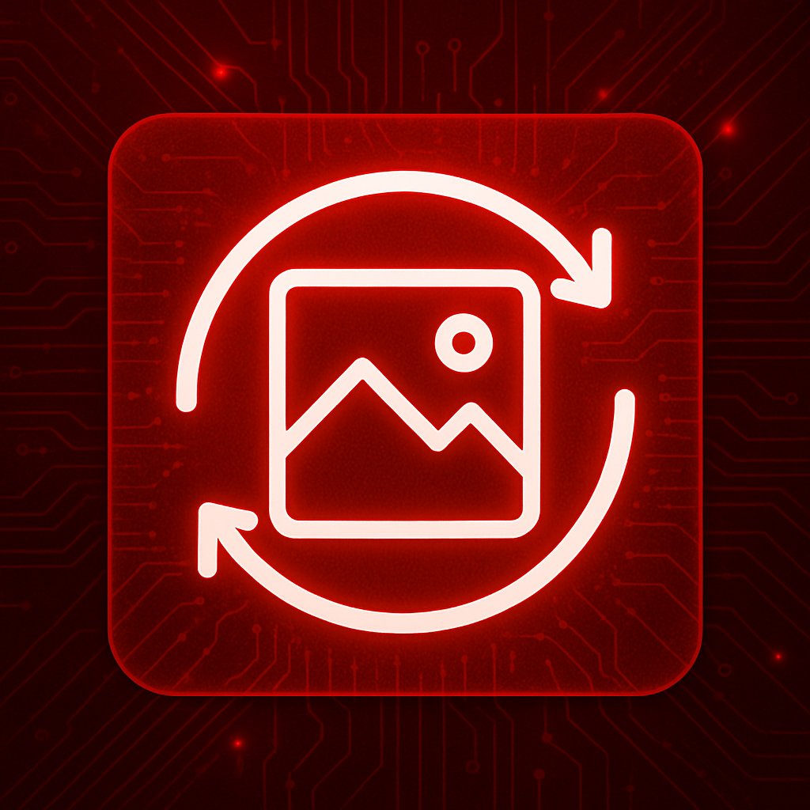
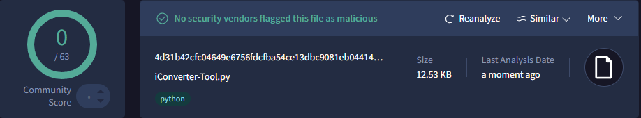
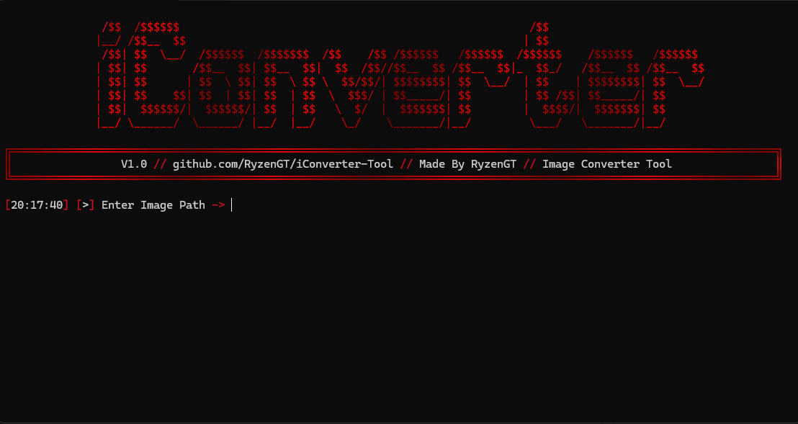
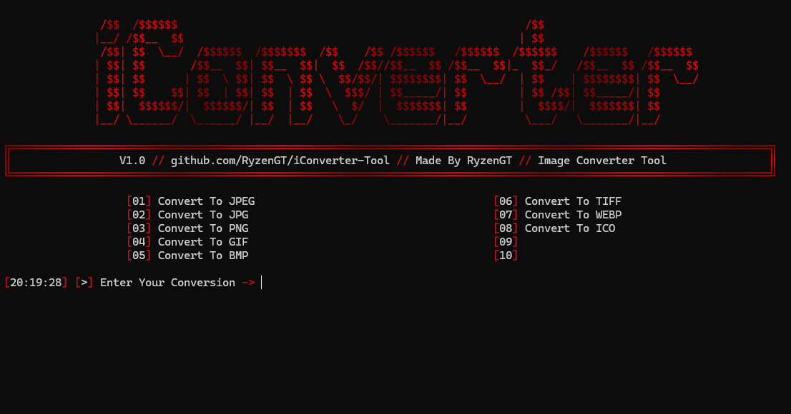

<h1 align="center">iConverter / By RyzenGT 
</h1>

## 🔧 Instructions:
- Install [Python](https://www.python.org/ftp/python/3.13.3/python-3.13.3-amd64.exe) and add to PATH.
- [Download](https://github.com/RyzenGT/iConverter-Tool/releases/latest) the `.zip` file and place all the files in a single folder.
- Make sure `iConverter-Tool.py` and `Converted-Image` are grouped together.
- Double-click `iConverter-Tool.py`.
- The tool is ready to launch, **enjoy!**

> **Image converter developed by RyzenGT — powerful, fast, and beautiful**\
> *Send me a DM if there's any problem :* `kng.sgao`

## 📸 Menu Picture:

  

  

## ⚠️ Disclaimer:

- Please do not resell, distribute or modify without my written consent.
